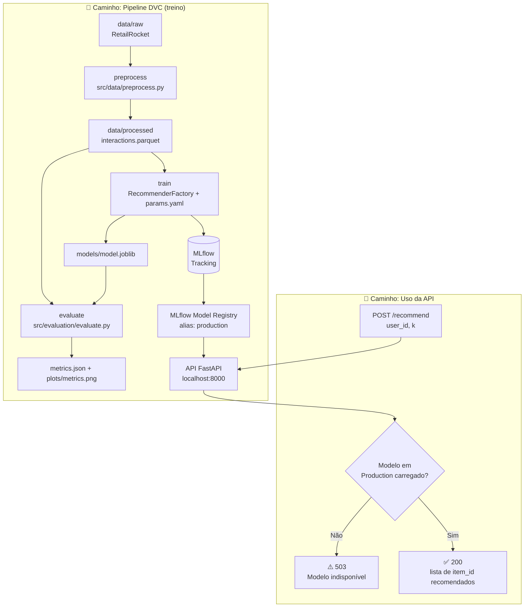

# Ecommerce Recsys MLOps

Projeto desenvolvido para o Tech Challenge da Fase 2 do curso de Machine Learning Engineering da FIAP, focado na construção de um sistema de recomendação de produtos end-to-end para e-commerce com modelos baselines, experimentos e Model Registry rastreados via MLflow, pipeline de dados reprodutível com DVC e serviço provisionado via API em FastAPI, containerizado com Docker.

Para um resumo rápido, também temos um [🎥Vídeo Explicativo em menos de 5 min](https://youtu.be/SEU_VIDEO_AQUI)

---


## 👥 Integrantes
| Nome | RM | Contato |
|--|--|--|
| Gabriel de Paula Vicente | RM373848 | [Github](https://github.com/gabrielpvicente) - [Linkedin](https://www.linkedin.com/in/gabriel-de-paula-vicente-796198102/)|
| Gustavo Dell Anhol Oliveira | RM372138 | [Github](https://github.com/gudaoliveira) - [Linkedin](https://www.linkedin.com/in/gustavodell/)|
| Kevin Pagrion Bela | RM371774 | [Github](https://github.com/kevinpabe) - [Linkedin](https://www.linkedin.com/in/kevinpb/)|
| Patrick Kwan | RM373172 | [Github](https://github.com/ptkwan) - [Linkedin](https://www.linkedin.com/in/patrick-kwan-617296220/)|
| Vitor Akira Ucha Ito | RM371483 | [Github](https://github.com/VitorAkira-me) - [Linkedin](https://www.linkedin.com/in/vitor-akira/)|

## 📋 Requisitos
- Python 3.13+
- `uv` instalado para gerenciamento de dependências
    - Aprenda como instalar o `uv` [aqui](https://docs.astral.sh/uv/getting-started/installation/)
- `Makefile` para comandos de conveniência (opcional, mas recomendado)
    - No Windows, você pode usar o [Windows Subsystem for Linux (WSL)](https://learn.microsoft.com/en-us/windows/wsl/install) para acessar o `Makefile`.

## ⚙️ Setup
Realize o clone do repositório com

```bash
git clone https://github.com/fiap-postech-ml-engineering/ecommerce-recsys-mlops

cd ecommerce-recsys-mlops
```
Crie o ambiente virtual
```bash
uv venv

#############################################
# Para acessar o ambiente virtual
Windows 		-> .venv\Scripts\activate
Linux / macOS 	-> source .venv/bin/activate
```

Instale as dependências com:
```bash
# (para dependências de produção)
uv sync

# (para dependências de desenvolvimento)
uv sync --extra dev
uv run pre-commit install
uv run pre-commit run --all-files
```

Configure o remote local do DVC (necessário antes de rodar `dvc push`/`dvc pull` — cada
pessoa aponta para uma pasta no próprio disco, fora do repositório; esse comando não é
compartilhado via Git, então rode-o uma vez por máquina):
```bash
# IMPORTANTE: O dataset precisa estar identico entre todos os usuarios, caso tenha dúvidas sobre o estado da sua pasta de dados, rode o make dataset para obter uma versão atualizada

# Use make dvc ou simplemente execute os comandos abaixos

dvc remote add -d localremote ~/dvc-storage --local
dvc commit data/raw.dvc
dvc push
```

## 📁 Organização do projeto

```
├── Dockerfile           <- Build multi-stage (builder + runtime) da API
├── docker-compose.yml   <- Orquestra o serviço `app` (FastAPI) via Docker
├── dvc.yaml             <- Pipeline DVC: preprocess → train → evaluate
├── dvc.lock             <- Lockfile do pipeline DVC (gerado por `dvc repro`)
├── params.yaml          <- Hiperparâmetros do pipeline, lidos pela RecommenderFactory
├── metrics.json          <- Métricas da última avaliação (`dvc metrics show`)
├── LICENSE              <- Licença open-source do projeto
├── Makefile             <- Comandos utilitários (`make test`, `make check`, `make docker-*`)
├── README.md            <- README principal para desenvolvedores do projeto
│
├── data
│   ├── raw             <- Dados brutos originais, versionados via DVC (`raw.dvc`)
│   └── processed        <- Interações processadas, prontas para treino/avaliação
│
├── docs
│   ├── model_card.md     <- Model Card: performance, arquitetura e limitações do modelo
│   ├── deploy_architecture.md <- Arquitetura da API e do deploy
│   ├── experimentos/     <- Registro de decisões e diagnósticos de cada experimento
│   ├── internal/         <- Requisitos do desafio e planejamento inicial
│   └── img/              <- Imagens usadas na documentação
│
├── models               <- Artefatos de modelo (`model.joblib`) e MLflow tracking local
│
├── notebooks            <- Jupyter notebooks: `01_eda`, `02_experiments`, `03_mlp`
│
├── scripts
│   └── validate_env.py   <- Valida se o ambiente local está configurado corretamente
│
├── pyproject.toml       <- Configuração do projeto: dependências (uv) e ferramentas (ruff, pytest)
│
├── src                  <- Código-fonte principal do projeto
│   ├── __init__.py
│   ├── config.py         <- Settings (Pydantic) com hiperparâmetros e variáveis de ambiente
│   ├── logging_config.py <- Configuração central de logging
│   │
│   ├── api
│   │   ├── app.py         <- Aplicação FastAPI
│   │   ├── inference.py   <- RecommenderService, carrega o modelo em Production
│   │   ├── middleware.py  <- Middlewares da API
│   │   ├── schemas.py     <- Schemas Pydantic de request/response
│   │   └── routes/        <- `/health` e `/recommend`
│   │
│   ├── data
│   │   ├── loader.py       <- Download/carregamento do dataset (RetailRocket)
│   │   ├── filtering.py    <- k-core filtering para reduzir esparsidade
│   │   ├── preprocessor.py <- Pipeline de pré-processamento (sklearn)
│   │   ├── preprocess.py   <- Stage `preprocess` do DVC
│   │   ├── schema.py       <- Validação de schema (pandera)
│   │   └── split.py        <- Split temporal 60/20/20
│   │
│   ├── models
│   │   ├── base.py          <- BaseRecommender (Strategy)
│   │   ├── factory.py       <- RecommenderFactory (Factory Method)
│   │   ├── popularity.py, svd.py, mlp.py, als.py, bpr.py, itemknn.py <- Modelos do registry
│   │   └── _implicit_utils.py
│   │
│   ├── evaluation
│   │   └── evaluate.py      <- Stage `evaluate` do DVC — métricas + plot
│   │
│   ├── metrics
│   │   ├── ranking.py       <- Precision@K, Recall@K, NDCG@K, Hit Rate@K
│   │   └── business.py      <- Coverage, Revenue@K
│   │
│   ├── tracking
│   │   ├── mlflow_utils.py   <- Configuração e utilitários de tracking MLflow
│   │   └── promote_model.py  <- Promoção de modelo no Model Registry
│   │
│   └── training
│       └── train.py         <- Stage `train` do DVC
│
└── tests                <- Testes automatizados (pytest), markers unit/integration/model/api/slow
```

## 📚 Documentações

- [Model Card](docs/model_card.md) — detalhes técnicos do modelo, métricas, arquitetura e limitações
- [Arquitetura de Deploy](docs/deploy_architecture.md) — detalhes da implementação da API, configuração e limitações atuais

### Notas internas de processo

- [Planejamento inicial](docs/internal/planejamento_inicial.md) — decisões de dataset, EDA, modelagem e design patterns
- [Tech Challenge](docs/internal/tech_challenge.md) — requisitos, etapas e critérios de avaliação do desafio
- [Experimentos](docs/experimentos/) — registro de decisões e diagnósticos de cada experimento de modelagem

## 🔄 Fluxograma do projeto



## 🚀 Execução do projeto

Depois do [Setup](#️-setup), existem dois caminhos possíveis — retreinar o pipeline ou apenas usar a API com o modelo que já está em Production (ver [Fluxograma](#-fluxograma-do-projeto)).

**O projeto roda de ponta a ponta sem nenhuma credencial externa.** O dataset (RetailRocket) é baixado publicamente via `kagglehub`, sem necessidade de login. O MLflow tem dois backends possíveis, controlados por `MLFLOW_TRACKING_URI`:

- **`local` (padrão do `.env.example`)** — tracking e Model Registry ficam em `logs/mlruns`/`models/mlruns`, no seu próprio disco. É o caminho usado por quem só quer clonar o projeto e ver tudo funcionando (treino, promoção de modelo, API), sem depender do workspace do time.
- **`databricks`** — usado pelo time no dia a dia (exige `DATABRICKS_HOST`/`DATABRICKS_TOKEN` no `.env`, credenciais internas do grupo).

Os passos abaixo funcionam igual nos dois modos — só muda o valor de `MLFLOW_TRACKING_URI` no `.env`.

### 1. Configurar variáveis de ambiente

Copie o `.env.example` para `.env`:

```bash
cp .env.example .env
```

O `.env.example` já vem com `MLFLOW_TRACKING_URI=local` — não precisa preencher nada para rodar localmente. Se você faz parte do time e quer usar o workspace Databricks compartilhado, troque para `MLFLOW_TRACKING_URI=databricks` e preencha `DATABRICKS_HOST`/`DATABRICKS_TOKEN`.

Valide se o ambiente está corretamente configurado com:

```bash
uv run python scripts/validate_env.py
```

### 2. Obter o dataset

Se ainda não tiver `data/raw/` populado (ou quiser garantir que está na versão mais recente), baixe e processe o dataset:

```bash
make dataset
```

> Isso limpa `data/raw/` e baixa o dataset RetailRocket novamente via `src/data/loader.py`. Se você já tem `data/raw/` sincronizado via `dvc pull` (ver Setup), pode pular este passo.

### 3. (Opcional) Retreinar o pipeline

Só é necessário se você alterou dados, features, hiperparâmetros (`params.yaml`) ou o código de um dos modelos. Caso contrário, pule para o passo 4 — a API consome direto o modelo que já está em Production no MLflow Registry, sem precisar rodar nada localmente.

Rode o pipeline DVC completo (stages `preprocess` → `train` → `evaluate`, definidos em `dvc.yaml`):

```bash
uv run dvc repro
```

Isso gera/atualiza:
- `data/processed/interactions.parquet` — dados pré-processados
- `models/model.joblib` — artefato do modelo treinado (tipo definido em `params.yaml`)
- `metrics.json` e `plots/metrics.png` — métricas de avaliação no `test_df`

Para rodar um stage isolado (ex: só reavaliar sem retreinar):

```bash
uv run dvc repro evaluate
```

Para comparar as métricas do run atual com o commit anterior:

```bash
uv run dvc metrics diff
```

### 4. (Opcional) Promover um modelo para Production

Depois de um `dvc repro`, o modelo treinado fica logado no MLflow, mas **não é automaticamente promovido**. A promoção é manual, em duas etapas (`src/tracking/promote_model.py`):

```bash
# 1. Registra a versão do run mais recente do pipeline e marca como "staging".
#    Imprime uma amostra de recomendações para inspeção manual.
uv run python -m src.tracking.promote_model --stage staging

# 2. Depois de validar manualmente a amostra acima, promove staging -> production.
uv run python -m src.tracking.promote_model --stage production
```

> A API só serve o modelo com alias `production` no Registry. Se você promover um modelo novo enquanto a API já está rodando, é preciso reiniciá-la — o carregamento acontece uma única vez, no startup (`lifespan` em `src/api/app.py`).

#### Visualizar experimentos na MLflow UI (backend local)

Se `MLFLOW_TRACKING_URI=local`, o tracking e o Model Registry ficam em arquivos locais
(`logs/mlruns`/`models/mlruns`). Para inspecionar visualmente os experimentos e o Registry:

```bash
make mlflow-ui
```

> Equivalente a `MLFLOW_ALLOW_FILE_STORE=true uv run mlflow ui --backend-store-uri
> "file://$(pwd)/logs/mlruns" --default-artifact-root "file://$(pwd)/models/mlruns" --port
> 5000`. A variável `MLFLOW_ALLOW_FILE_STORE=true` é necessária porque o MLflow ≥ 3 bloqueia
> o backend de arquivo local por padrão (modo manutenção) — o `make mlflow-ui` já cuida
> disso.

Acesse `http://localhost:5000` para ver os experimentos, runs e o Model Registry.

### 5. Subir a API

**Localmente**, com hot-reload:

```bash
make init
```

**Ou via Docker** (build multi-stage + compose):

```bash
make docker-up
# ou em background:
make docker-up-detached
```

A API sobe em `http://localhost:8000`. Documentação interativa automática em `http://localhost:8000/docs` (Swagger) ou `/redoc`.

### 6. Testar a API

Verificar se o modelo está carregado:

```bash
curl http://localhost:8000/health
```

```json
{"api_status": "operacional", "modelo_carregado": true}
```

Pedir uma recomendação (`user_id` obrigatório, `k` opcional — usa `RECOMMENDATION_K` do `.env` se omitido):

```bash
curl -X POST http://localhost:8000/recommend \
  -H "Content-Type: application/json" \
  -d '{"user_id": 12345, "k": 10}'
```

```json
{"user_id": 12345, "recommendations": [67890, 11223, 44556, 78901, 23456, 90123, 45678, 12309, 56784, 89012]}
```

Se nenhum modelo estiver em Production ainda (Registry vazio), a resposta é `503`:

```json
{"detail": "Modelo ainda não disponível em Production no MLflow Registry."}
```

### 7. Parar os serviços

```bash
make stop
# equivalente a: make docker-down
```

## ✅ Testes e validação

O projeto tem 17 módulos de teste em `tests/`, cobrindo dados, modelos, tracking, API e o pipeline de ponta a ponta. Nenhum deles depende de credenciais externas (Databricks/Kaggle) — todos rodam isolados, com fixtures/mocks.

### Rodando os testes

```bash
make test
```

Equivalente a `pytest tests/ -v --no-cov -m "not slow"` — roda tudo exceto os testes marcados como lentos.

Para rodar com relatório de cobertura (mínimo exigido: 70% sobre `src/`, ver `pyproject.toml`):

```bash
make test-cov
```

Isso gera um relatório HTML em `htmlcov/index.html`, além do resumo no terminal.

Para incluir os testes lentos também:

```bash
make test-slow    # só os marcados como slow
make check-slow   # lint + format + todos os testes, incluindo slow
```

### Markers disponíveis

Os testes são organizados por marker (`pyproject.toml`, `[tool.pytest.ini_options]`), o que permite rodar só um subconjunto com `pytest -m <marker>`:

| Marker | O que cobre |
| --- | --- |
| `unit` | Testes unitários (padrão da maioria dos módulos) |
| `integration` | Integração entre componentes (ex: pipeline DVC ponta a ponta) |
| `model` | Modelos de recomendação — `fit`/`recommend`/`get_params` de cada `BaseRecommender` |
| `api` | Endpoints FastAPI (`/health`, `/recommend`) |
| `slow` | Testes mais pesados, excluídos do `make test` padrão |

Exemplo — rodar só os testes de modelo:

```bash
uv run pytest tests/ -v -m model
```

### Smoke test do pipeline

`tests/test_pipeline_smoke.py` roda a cadeia `preprocess -> train -> evaluate` como chamadas de função Python diretas, sobre uma amostra sintética pequena — sem invocar o binário `dvc` nem depender do dataset real via `kagglehub`. É o teste mais próximo de "o pipeline inteiro funciona" que roda em segundos, útil para validar mudanças estruturais sem esperar o `dvc repro` completo.

### CI

`[A PREENCHER]` — ainda não há pipeline de CI configurado (GitHub Actions ou similar) para rodar `make check` automaticamente em cada PR; hoje a validação é manual antes do merge.

## 🔧 Pontos de melhoria

Durante o desenvolvimento do projeto, algumas decisões foram tomadas visando a entrega dentro do prazo, mas que poderiam ser melhoradas com mais tempo, como por exemplo:

- O MLP (modelo central exigido pelo desafio) perde para o ItemKNN por ~25x em NDCG@10 — foi treinado e comparado (ver [Model Card](docs/model_card.md)), mas com pouco tuning de hiperparâmetros; há espaço real de melhoria (negative sampling, arquitetura de duas torres, mais épocas).
- Cold start não é tratado — usuários sem histórico no treino não recebem recomendação personalizada.
- O remote do DVC é local/individual (`~/dvc-storage`), sem sincronização real entre máquinas do time — falta provisionar um remote compartilhado (S3).
- Sem deploy em nuvem (bônus do desafio) — a API só roda localmente; o `Dockerfile` já está pronto, falta o provisionamento de infraestrutura.
- Sem CI/CD — `make check` roda só manualmente antes do merge.
- A API não tem autenticação, rate limiting nem versionamento de endpoint (ver [Arquitetura de Deploy](docs/deploy_architecture.md)).
